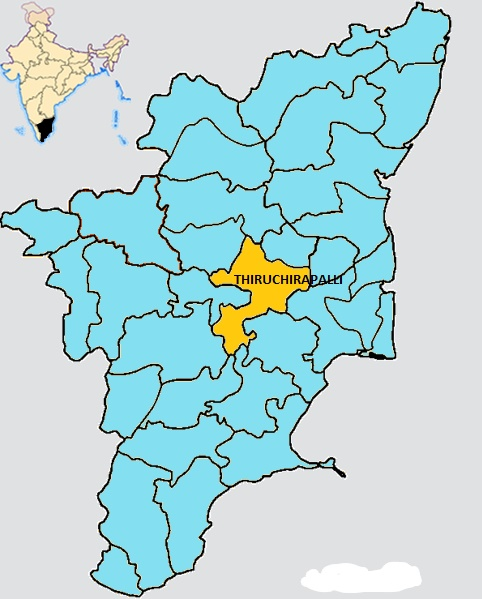

Welcome to my birthplace **Tiruchirappalli** also shortly known as **Trichy** is an historical place located in the state of Tamil Nadu in southern India. Trichy got its nickname [**Rock Fort City**](https://en.wikipedia.org/wiki/Tiruchirapalli_Rock_Fort) beacuse of the rock fort temple locally refered as **Malaikottai** is a **Lord Ganesh Shrine**. The term Malaikottai is directly translated as mountain fort from the local langauge, this was due to the fact of the frequent fortification of this area by the Vijayanagara Empire to defend themselves in war.

## Geography.

Tiruchirappalli is situated at the **geographic centre of the state of Tamil Nadu**. The Cauvery Delta begins to form **16 kilometres (9.9 mi)** west of the city where the river divides into two streams the Kaveri and the Kollidam to form the island of Srirangam. The topology of Tiruchirappalli is almost flat with an average elevation of **88 metres (289 ft).** A few isolated hillocks rise above the surface, the highest of which is the **Rockfort**; its estimated age of **3,800 million years** makes it one of the oldest rocks in the world.

Apart from Kaveri and its tributary Kollidam, the city is also drained by the Uyyakondan Channel, Koraiyar and Kudamurutti river channels. The land immediately surrounding the Kaveri River which crosses Tiruchirappalli from west to east consists of deposits of fertile alluvial soil on which crops such as finger millet and maize are cultivated. Further south, the surface is covered by poor quality black soil. A belt of Cretaceous rock known as the Trichinopoly Group runs to the northeast of the city, and to the south-east there are layers of archaean rocks, granite and gneiss covered by a thin bed of conglomeratic laterite.

- Trichy is a city build on the banks of river [Kaveri.](https://en.wikipedia.org/wiki/Kaveri)
- Trichy has a unique feature that cannot be found in any other cities in allover India that is it has its **own island** within it.
  - The island of **Srirangam** is a municipality located inbetween river Kaveri and its branch river Kollidam.
- Trichy is located within the region known as the the [**Delta Plateau**](https://en.wikipedia.org/wiki/Deccan_Plateau) which is rich in fertile agricultural soil and water.

The city of Tiruchirappalli lies on the plains between the [**Shevaroy Hills**](https://en.wikipedia.org/wiki/Shevaroy_Hills) to the north and the [**Palani Hills**](https://en.wikipedia.org/wiki/Palani_Hills) to the south and south-west. Tiruchirappalli is completely surrounded by agricultural fields. Densely populated industrial and residential areas have recently been built in the northern part of the city, and the southern edge also has residential areas. The older part of Tiruchirappalli, within the Rockfort, is unplanned and congested while the adjoining newer sections are better executed. Many of the old houses in Srirangam were constructed according to the shilpa sastras, the canonical texts of Hindu temple architecture.

### Culture

Situated at the edge of the Kaveri Delta, the culture of Tiruchirappalli is predominantly Brahminical, prevalent elsewhere in the delta. With a substantial population of students and migrant industrial workers from different parts of India, Tiruchirappalli has a more cosmopolitan outlook than the surrounding countryside. The main festival celebrated in Tiruchirappalli is [Pongal](https://en.wikipedia.org/wiki/Pongal_(festival)), a regional harvest festival celebrated during January. As part of the Pongal celebrations, Jallikattu, a bull-taming village sport played on the last day of the festival, is occasionally held on the outskirts of the city. Aadi Perukku, Samayapuram flower festival, Vaikunta Ekadasi, and the Teppakulam float festival are some of the prominent festivals that are held locally. Bakrid and Eid al-Fitr are also widely celebrated, owing to the substantial number of Muslims in the city. Nationwide festivals such as the Gregorian New Year, Christmas, Deepavali and Holi are also celebrated in Tiruchirappalli.

The 12th century Tamil epic Kambaramayanam was first recited at the Ranganathaswamy temple in Srirangam. In 1771, Rama Natakam, a musical drama written Arunachala Kavi and based on the Ramayana, was also performed there. Tiruchirappalli was home to some of the prominent Carnatic musicians—including Lalgudi Jayaraman, Srirangam Kannan and A. K. C. Natarajan—and scholars such as T. S. Murugesan Pillai, Kundalam Rangachariar and K. A. P. Viswanatham. Composers, poets and vocalists such as G. Ramanathan, T. K. Ramamoorthy, Vaali and P. Madhuri, who have made significant contributions to Tamil film music hail from the city.

> Textile weaving, leather-work and gem cutting are some of the important crafts practised in Tiruchirappalli. Wooden idols of Hindu gods and goddesses are sold at Poompuhar, the crafts emporium run by the Government of Tamil Nadu.
> The Trichy Travel Federation (TTF) was formed on 5 May 2009 to promote Tiruchirappalli as a favourable tourist destination.
> The federation organises an annual food festival called Suvai. Lack of infrastructure has been a major deterrent to the city's tourism industry.

*Content credit @ [Wikipedia](https://en.wikipedia.org/wiki/Tiruchirappalli)*